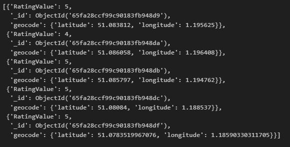

# NoSQL Challenge

[NoSQL Challenge Setup Code Link]( https://github.com/MichaelELeonard/nosql-challenge/blob/main/NoSQL_setup_working.ipynb)

[NoSQL Challenge Analysis Code Link]( https://github.com/MichaelELeonard/nosql-challenge/blob/main/NoSQL_analysis_working.ipynb)

 

## The Scenario
The UK Food Standards Agency evaluates various establishments across the United Kingdom and gives them a food hygiene rating. We have been contracted by the editors of a food magazine, Eat Safe, Love, to evaluate some of the ratings data to help their journalists and food critics decide where to focus future articles.

### Part 1: Database and Jupyter Notebook Set Up 
A json file of data was imported using the mongoimport command: 

An instance of the MongoClient was established and a print statement was used to confirm that the ‘uk_food’ database had been successfully imported and was available.  

‘Establishments’ was identified as the only collection in the ‘uk_food’ database.

### Part 2: Update the Database
A new document entry for the restaurant ‘Penang Flavours’ was added to the existing ‘establishments’ collection.  
 

We then needed to establish which ‘BusinessTypeID’ should be assigned to the ‘Penang Flavours’ to update it correctly.  We accomplished this by finding out what ID other establishments were assigned of the same business type and updating the ‘BusinessTypeID’ for ‘Penang Flavours’ with that same ID to ensure consistency within the collection.  

We needed to establish how many documents (restaurants) in the collection there were from the Dover Local Authority and remove them from the DataBase.  The Dover establishments were counted and returned a total of 994.  The Dover establishments were deleted and confirmed, returning a count of 0. 

We then needed to do some cleaning and updating of the database to prepare it for analysis.  The geocode.longitude & geocode.latitude variables were cast to doubles, any non 1-5  Rating Values to Null, and RatingValues were cast to intergers.  The first five results in the database were checked to ensure that the changes were implemented correctly.

### Part 3: Exploratory Analysis
There were four questions that were examined by the analysis portion of the NoSQL-Challenge.  These four questions included:
* Which establishments have a hygiene score equal to 20?
* Which establishments in London have a “RatingValue” greater than or equal to 4?
* What are the top 5 establishments with a “RatingValue” rating value of 5, sorted by lowest hygiene score, nearest to the new restaurant added, "Penang Flavours"?
* How many establishments in each Local Authority area have a hygiene score of 0?
 
### Which establishments have a hygiene score equal to 20?

### Which establishments in London have a “RatingValue” greater than or equal to 4?

### What are the top 5 establishments with a “RatingValue” rating value of 5, sorted by lowest hygiene score, nearest to the new restaurant added, "Penang Flavours"?

### How many establishments in each Local Authority area have a hygiene score of 0?

