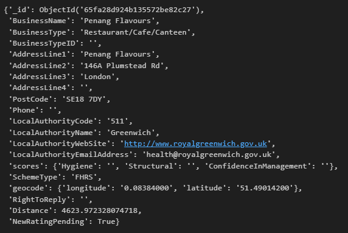
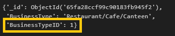

# Week 12 - NoSQL-Challenge

## THE SCENARIO
The UK Food Standards Agency evaluates various establishments across the United Kingdom and gives them a food hygiene rating. You've been contracted by the editors of a food magazine, Eat Safe, Love, to evaluate some of the ratings data to help their journalists and food critics decide where to focus future articles.

### PART 1: DATABASE AND JUPYTER NOTEBOOK SET UP 
To start this challenge a json file of data was imported the terminal using the mongoimport command: 

A Jupyters notebook file ‘NoSQL_setup_working’ was opened in a MS VSCode environment and the dependencies needed for the project were imported:

An instance of the MongoClient was established and a print statement was used to confirm that the ‘uk_food’ database had been successfully imported and was available.  

Finally, the uk_food database was assigned to a variable ‘uk_foods_db’, the collection names in the database were reviewed, the first collection of data was viewed to ensure that the set-up process was implemented correctly, and the establishments collection was assigned to a variable ‘establishments’.

### PART 2: UPDATE THE DATABASE
A new restaurant ‘Penang Flavours’ and a dictionary of its corresponding data was saved in a variable ‘new_restaurant _entry’ and added to the existing establishments collection using an insert_one command.  Finally, a find_one command was used to confirm that the ‘Penang Flavours’ restaurant was successfully added to the establishments collection.   
 

We then needed to establish which ‘BusinessTypeID’ should be assigned to the ‘Penang Flavours’ to update it correctly.  We accomplished this by finding out what ID other establishments were assigned of the same business type and updating the ‘BusinessTypeID’ for ‘Penang Flavours’ with that same ID to ensure consistency within the collection.  The steps in this process were to find another restaurant in the ‘establishments’ collection with an identical ‘BusinessType’ and returning the 'BusinessTypeID' & 'BusinessType' fields and then setting the 'BusinessTypeID' of ‘Penang Flavours’ to the identified ID for consistenancy within the collection.  Finally, we again viewed the ‘Penang Flavours’ data to ensure that the 'BusinessTypeID' field was successfully updated.   

We then needed to establish how many documents (restaurants) in the collection there were from the Dover Local Authority and remove them from the DataBase.  The Dover establishments were counted using the count_documents command and returned a total of 994.  The Dover establishments were then deleted using the delete_many command, and then the Dover establishments were again counted showing a result of 0.  Finally, the we used the find_one command to ensure that the other restaurants still remained in the database.    

We then needed to do some cleaning and updating of the database to prepare it for analysis.  We cast all the geocode.longitude & geocode.latitude variables in the database to doubles, updated any non 1-5  Rating Values to Null, and cast the RatingValue to an interger.  For all three steps we used the update_many function with the following code:

Finally, the first five results in the database were checked to ensure that the changes were implemented correctly.  The following code was used to ensure that the changes were made correctly:  

### PART 3: EXPLORATORY ANALYSIS
For the analysis portion of the challenge the same uk_food database and establishments collections were used and a jupyter file named ‘NoSQL_analysis_working’ was established.  The importing of dependencies and a database connection was implemented consistent with the techniques used earlier in the code.  The only difference in the setup was ‘import pandas as pd’ was imported to add the Pandas Dataframe functionality to the analysis.  

There were four questions that were examined by the analysis portion of the NoSQL-Challenge.  These four questions included:
* Which establishments have a hygiene score equal to 20?
* Which establishments in London have a `RatingValue` greater than or equal to 4?
* What are the top 5 establishments with a `RatingValue` rating value of 5, sorted by lowest hygiene score, nearest to the new restaurant added, "Penang Flavours"?
* How many establishments in each Local Authority area have a hygiene score of 0?

   
The results of these four questions were pulled from the database using techniques learned in class with the solution then uploaded into a Pandas Dataframe for examination.   

#### WHICH ESTABLISHMENTS HAVE A HYGIENE SCORE EQUAL TO 20?
For this question a query was set up using 'scores.Hygiene' = 20 and then the query established using the .find function with the results being stored in a variable called ‘hygiene_results’.  The count_doucments function was used to display the number of documents (restaurants) resulting from the query, with the total stored in ‘hygiene_count’.  The resulting count output was 41 establishments had hygiene scores = 20 and the find_one function was used to display the first establishment meeting the criteria.  The code used to acquire the desired result was:
hygiene_query = {'scores.Hygiene' : 20}

hygiene_results = establishments.find(hygiene_query)

hygiene_count = establishments.count_documents(hygiene_query)

print(f'{hygiene_count} establishments had hygiene scores = 20.')
print('')
print('--------------------')
print('')

pprint(establishments.find_one(hygiene_query)) 

returning:

41 establishments had hygiene scores = 20.

--------------------

{'AddressLine1': '5-6 Southfields Road',
 'AddressLine2': 'Eastbourne',
 'AddressLine3': 'East Sussex',
 ...
 'RatingKey': 'fhrs_0_en-gb',
 'RatingValue': 0,
 ...
          'returncode': None,
          'totalCount': 0,
          'totalPages': 0},
 'scores': {'ConfidenceInManagement': 20, 'Hygiene': 20, 'Structural': 20}}

The variable ‘hygiene_results’ was then read into a Pandas DataFrame using:
•	hygiene_results_df = pd.DataFrame(hygiene_results) 

The number of rows in the ‘hygiene_results_df’ was established for consistency using:   
•	len(hygiene_results_df)

And a portion of ‘hygiene_results_df’ was displayed using:
•	hygiene_results_df.head(10)

### WHICH ESTABLISHMENTS IN LONDON HAVE A `RATINGVALUE` GREATER THAN OR EQUAL TO 4?
For this question a query ‘RatingValue_query’ was set up to find any permutation of London in the field 'LocalAuthorityName' which also had a ‘RatingValue’ of greater than or equal to 4.  ‘RatingValue_query’ used the '$regex' function to locate London in the 'LocalAuthorityName' and '$gte' was used to find the RatingValues greater than or equal to 4.  ‘RatingValue_query’ was used with a .find function to query the establishments collection and the results being stored in the variable RatingValue_results.  The count_doucments function was used to display the number of documents (restaurants) resulting from the query with the total stored in ‘RatingValue_count’.  The resulting count output was that there was 33 establishments in London with RatingValue >= 4.and the find_one function was used to display the first establishment meeting the criteria.  The code used to acquire the desired result was:
RatingValue_query = {"LocalAuthorityName":{'$regex' : "London"}, "RatingValue" : {'$gte' : 4}}

RatingValue_results = establishments.find(RatingValue_query)

RatingValue_count = establishments.count_documents(RatingValue_query)

print(f"There are {RatingValue_count} documents for London establishments with RatingValue >= 4.")
print('')
print('--------------------')
print('')

pprint(establishments.find_one(RatingValue_query))

returning:

There are 33 documents for London establishments with RatingValue >= 4.

--------------------

{'AddressLine1': 'Oak Apple Farm Building 103 Sheernes Docks',
 'AddressLine2': 'Sheppy Kent',
  ...
          'returncode': None,
          'totalCount': 0,
          'totalPages': 0},
 'scores': {'ConfidenceInManagement': 5, 'Hygiene': 5, 'Structural': 10}}

The variable ‘RatingValue_results’ was then read into a Pandas DataFrame using:
RatingValue_results_df = pd.DataFrame(RatingValue_results)

The number of rows in the ‘RatingValue_results_df’ was established for consistency using:   
•	len(RatingValue_results_df)

And a portion of RatingValue_results_df was displayed using:
•	RatingValue_results_df.head(10)
### WHAT ARE THE TOP 5 ESTABLISHMENTS WITH A `RATINGVALUE` RATING VALUE OF 5, SORTED BY LOWEST HYGIENE SCORE, NEAREST TO THE NEW RESTAURANT ADDED, "PENANG FLAVOURS"?
For this portion we needed to identify the top five establishments within a 0.01 longitude and latitude range of the Penang Flavours restaurant with a rating value of 5 and the lowest hygiene score.  Initially, the geographic coordinates were pulled using a find_one function looking for the ‘BusinessName’ ‘Penang Flavours’ and acquiring the geocode for its location which was stored in a variable called ‘target_coordinates’.  The specific longitude and latitude coordinates were then extracted from ‘target_coordinates’ and stored in variables called ‘longitude_coordinate’ & ‘latitude_coordinate’ and the 0.01 surrounding distance was stored in a variable called ‘extra_distance’.   A query called ‘location_query’ was formulated using the specific Penang Flavours location coordinates and adding the extra distance to one side and subtracting the distance from the other side and then using the $gte' & '$lte' functions to find the search diameter with the original location in the middle.  This process was conducted for both the of the original longitudinal and latitudinal coordinates effectively creating a circle with a radius 0.01 surrounding Penang Flavours.  Finally, a criteria of 'RatingValue' = 5 was added to ‘location_query’ completing the query call.  The variable ‘sort’ set was used to sort the 'scores.Hygiene' values in descending order placing the lowest hygiene scores in ascending order, and ‘limit’ was used to set the results to the top five establishments.   The establishments collection was the queried using the .find function and the prepared variables ‘location_query’, ‘sort’ & ‘limit’ variables, with the results placed in a list and stored in ‘location_results’.  A for-loop was used the cycle through the ‘location_results’ and print the results using pprint.  The final step was to put the ‘location_results’ into a dataframe called ‘location_results_df’ using the ‘pd.json_normalize’ function to expand the sub-dictionaries for clarity.  The python code used to accomplish the third portion of the analysis was:
target_coordinates = establishments.find_one({"BusinessName":"Penang Flavours"},{"geocode" : 1})

longitude_coordinate = target_coordinates['geocode']['longitude']
latitude_coordinate = target_coordinates['geocode']['latitude']
extra_distance = 0.01

location_query = {'geocode.longitude':{'$gte': longitude_coordinate - extra_distance, '$lte': longitude_coordinate + extra_distance},
                'geocode.latitude':{'$gte': latitude_coordinate - extra_distance, '$lte': latitude_coordinate + extra_distance},
                'RatingValue':5}

sort = [('scores.Hygiene', 1)]

limit = 5

location_results = list(establishments.find(location_query).sort(sort).limit(limit))

for location in location_results:
    pprint(location)

location_results_df = pd.json_normalize(location_results)

location_results_df

### HOW MANY ESTABLISHMENTS IN EACH LOCAL AUTHORITY AREA HAVE A HYGIENE SCORE OF 0?
For the final portion of the analysis we needed to set up a query pipeline that matched 'scores.Hygiene' values of 0, grouped by '$LocalAuthorityName', with a variable 'count' established and sorted in descending order.  The variables ‘match’, ‘group’ and ‘sort’ were then placed in a list and with named ‘pipeline’.  The list ‘pipeline’ was fed into the establishments.aggregate function with the results placed into a list and stored in a variable ‘pipeline_results’.  The number of documents (restaurants) was found using the ‘len’ function totaling 55, and the first ten results were displayed using the pprint function.  The final step was to put the ‘pipeline_resultsinto a dataframe called ‘pipeline_results_df’ using the ‘pd.json_normalize’ function to expand the sub-dictionaries for clarity.  The python code used to accomplish the fourth portion of the analysis was:
match = {'$match': {'scores.Hygiene' : 0}}

group = {'$group': {'_id' : '$LocalAuthorityName' , 'count' : {'$sum':1}}}

sort = {'$sort':{'count' : -1}}

pipeline = [match, group, sort]

pipeline_results = list(establishments.aggregate(pipeline))

print(f'{len(pipeline_results)} documents in the result.')
print('')
print('--------------------')
print('')

pprint(pipeline_results[0:10])

pipeline_results_df = pd.json_normalize(pipeline_results)

print(f'The number of rows in this DataFrame is: {len(pipeline_results_df)}')
print('')
print('--------------------')
print('')

pipeline_results_df.head(10)     

