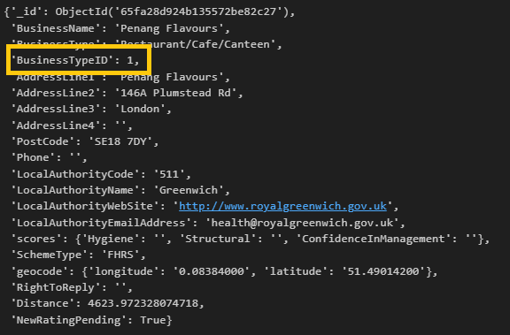
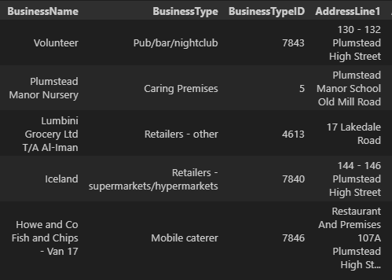
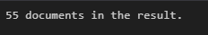

# NoSQL Challenge

NoSQL Challenge Setup Code - https://github.com/MichaelELeonard/nosql-challenge/blob/main/NoSQL_setup_working.ipynb

NoSQL Challenge Analysis Code - https://github.com/MichaelELeonard/nosql-challenge/blob/main/NoSQL_analysis_working.ipynb

 

## THE SCENARIO
The UK Food Standards Agency evaluates various establishments across the United Kingdom and gives them a food hygiene rating. We have been contracted by the editors of a food magazine, Eat Safe, Love, to evaluate some of the ratings data to help their journalists and food critics decide where to focus future articles.

### PART 1: DATABASE AND JUPYTER NOTEBOOK SET UP 
A json file of data was imported the terminal using the mongoimport command: 

An instance of the MongoClient was established and a print statement was used to confirm that the ‘uk_food’ database had been successfully imported and was available.  

The uk_food database was assigned to a variable ‘uk_foods_db’, the collection names in the database were reviewed, the first collection of data was viewed to ensure that the set-up process was implemented correctly, and ‘establishments’ was identified as the existing table.

### PART 2: UPDATE THE DATABASE
A new restaurant ‘Penang Flavours’ and a dictionary of its corresponding data was saved in a variable ‘new_restaurant _entry’ and added to the existing establishments collection using an insert_one command.  Finally, a find_one command was used to confirm that the ‘Penang Flavours’ restaurant was successfully added to the establishments collection.   
 

We then needed to establish which ‘BusinessTypeID’ should be assigned to the ‘Penang Flavours’ to update it correctly.  We accomplished this by finding out what ID other establishments were assigned of the same business type and updating the ‘BusinessTypeID’ for ‘Penang Flavours’ with that same ID to ensure consistency within the collection.  

We needed to establish how many documents (restaurants) in the collection there were from the Dover Local Authority and remove them from the DataBase.  The Dover establishments were counted using the count_documents command and returned a total of 994.  The Dover establishments were then deleted using the delete_many command and then the Dover establishments were again counted showing a result of 0.

We then needed to do some cleaning and updating of the database to prepare it for analysis.  We cast all the geocode.longitude & geocode.latitude variables in the database to doubles, updated any non 1-5  Rating Values to Null, and cast the RatingValue to an interger.  For all three steps we used the update_many function with the following code:

The first five results in the database were checked to ensure that the changes were implemented correctly.  The following code was used to ensure that the changes were made correctly:  

### PART 3: EXPLORATORY ANALYSIS
For the analysis portion of the challenge the same uk_food database and establishments collections were used and a jupyter file named ‘NoSQL_analysis_working’ was established.  The importing of dependencies and a database connection was implemented consistent with the techniques used earlier in the code.  The only difference in the setup was ‘import pandas as pd’ was imported to add the Pandas Dataframe functionality to the analysis.  

There were four questions that were examined by the analysis portion of the NoSQL-Challenge.  These four questions included:
* Which establishments have a hygiene score equal to 20?
* Which establishments in London have a “RatingValue” greater than or equal to 4?
* What are the top 5 establishments with a “RatingValue” rating value of 5, sorted by lowest hygiene score, nearest to the new restaurant added, "Penang Flavours"?
* How many establishments in each Local Authority area have a hygiene score of 0?
 
### WHICH ESTABLISHMENTS HAVE A HYGIENE SCORE EQUAL TO 20?

### WHICH ESTABLISHMENTS IN LONDON HAVE A “RATINGVALUE” GREATER THAN OR EQUAL TO 4?

### WHAT ARE THE TOP 5 ESTABLISHMENTS WITH A `RATINGVALUE` RATING VALUE OF 5, SORTED BY LOWEST HYGIENE SCORE, NEAREST TO THE NEW RESTAURANT ADDED, "PENANG FLAVOURS"?

### HOW MANY ESTABLISHMENTS IN EACH LOCAL AUTHORITY AREA HAVE A HYGIENE SCORE OF 0?

